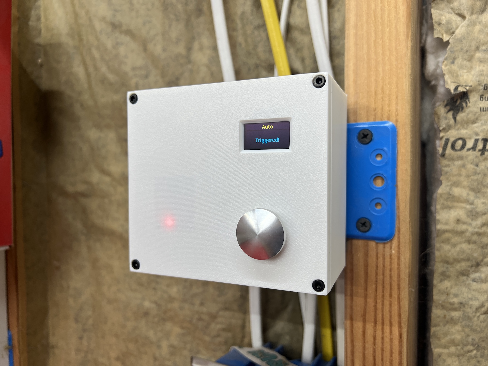

# Radar Light Control

This is an Arduino-based project that uses a [frequency-modulated continuous-wave (FMCW) radar](https://en.wikipedia.org/wiki/Continuous-wave_radar#Modulated_continuous-wave) to detect human presence and trigger a relay.  My purpose was to control the lights in my workshop by having them stay on while I was inside, but keep them off during my absence.

:point_right: This is not meant to be a community-driven project; I am only sharing this project in the public domain purely for reference, inspiration, and educational purposes.

> [!IMPORTANT]
> If you plan on building one of these to replace an existing light switch, a neutral wire must be present!  [See the section below for details](#heads-up-a-neutral-wire-is-required).

### :warning: Disclaimer & Release of Liability

This device was designed with the ability to control household mains power (120 VAC single-phase).  Certain basic precautions have been followed in the design, to the best of my knowledge, to ensure the finished device operates safely and does not present any significant risk of injury to persons nor damage to property.  However, I am not a licensed electrician and this device carries no official certification for it's safety nor suitability for its intended purpose.

Thus, my official position is that you _**do not connect this device onto your home's electrical system**_.  If you make a mistake during wiring or assembly, best-case scenario might be that you trip a breaker or fry the electronics, maybe even shit your pants.  Worst-case might be that you seriously injure or electrocute yourself and burn down your home.

Should you choose to proceed, _you are doing so at your own risk_, and I cannot be held liable for the consequences of your actions!

## Repo Contents

Here's a quick description of the files included in this repo:

 - [Firmware](/firmware)  
   Source code to the firmware that runs on the Arduino microcontroller, which uses my [DFR_Radar library](https://github.com/MaffooClock/DFR_Radar).

 - [Enclosure](/enclosure)  
   Source files for the 3D-printable double-gang enclosure: STL files for importing directly into your slicer, plus the parameterized F3D source file for editing in Autodesk Fusion 360.

 - [Photos](/photos)  
   Photos of the completed devices showing details of wiring and assembly, provided for reference.

## Bill of Materials

These components are pretty much mandatory, as the 3D-printable enclosure was designed to hold exactly these things:

 1. [Arduino Nano Every](https://amzn.to/40pJIUW)  
    Chosen for its simplicity, low cost, and high availability.

 2. [Arduino Nano Screw Terminal Adapter](https://amzn.to/3FNt5Jf)  
    Makes wiring easier and more secure than DuPont terminals, plus allows provides for mounting the Arduino to the enclosure.

 3. [DFRobot 24GHz Human Presence Detection Sensor](https://amzn.to/3u0QYdQ)  
    The thing around which this entire project was designed.  Derp.

 4. [0.96" 128x64 OLED Display](https://amzn.to/4638nQg)  
    Used to display status information, such as on/off/auto mode and countdown to off after trigger.  The firmware was designed to take advantage of the variant having the yellow/blue split, but it'll work just fine for single-color models.

 5. [5V Isolated Relay Module](https://amzn.to/3SyeOrx)  
    This is what is actually switching the 120VAC mains power to the light fixture in place of the original light switch.  These use an optocoupler to electrically isolate the 120VAC from the low-voltage electronics, along with the physical cutout on the PCB around the common terminal.

    **Note:** Ensure your lighting load is less than 1,000 watts!

 6. [Mini 120VAC-to-5VDC Power Supply Module](https://amzn.to/3SnFDPc)  
    This is how we power the low-voltage electronics.  According to my measurements, the completed device draws less than 200mA with the radar at full power and the relay active.

    **Note:** The switch box where the completed device is to be mounted _must_ contain a neutral conductor. [Read more below](#heads-up-a-neutral-wire-is-required)

 7. [16mm SPST Momentary Pushbutton](https://amzn.to/3QnYvel)  
    Used to select between auto mode and manual on/off mode.  There's nothing significant about the size, it's just what I had on hand when I started the project.  If you prefer a different size, you can change the size of the hole in the F3D file.

 8. [M2.5 and M3 Heatset Inserts](https://amzn.to/3QKliSW), [M2.5x4mm BHCS](https://amzn.to/3tVATWI) x8, [M3x10mm SHCS](https://amzn.to/3tVATWI) x4  
    The M2.5 are used to secure the Arduino Nano Screw Terminal Adapter and Relay Module to the enclosure using the 4mm button-head cap screws (BHCS); the M3 are for securing the face to the body using 10mm socket-head cap screw (SHCS).

 9. [M1.7x4mm Self-Tapping Screw](https://amzn.to/3QqtQNw) x6  
    These are used to secure the OLED Display and the Human Presence Detection Sensor to the enclosure.

These components could be considered optional since they are independant of the 3D-printable enclosure, but _highly_ recommended:

 10. [Wago Lever-Nuts](https://amzn.to/46hWjuV)  
     Used for the 5VDC connections (2x 5-port) as well as the mains 120VAC connections (1x 3-port, 2x 2-port).  This is the safest way of making connections inside the enclosure (especially with the 120VAC mains).

 11. [Wire Ferrules](https://amzn.to/464LFqW) (See [notes](#notes-about-ferrules) below)  
     Crimp these onto the ends of wires to make professional-looking and reliable connections to screw terminals and Wago connectors.  Better than solder-tinning, and certainly better than just twisting the wires with your fingers, wires can't fray and short out to neighboring terminals.

 12. [Fish Paper](https://amzn.to/49pSdTX)  
     This is used to insulate the bottom of the relay module and the power supply module to provide additional protection from short-circuiting.

     The self-adhesive variants aren't applicable to this project, as they won't stick to PCBs with through-hole component leads poking down.  But the self-adhesive is still suitable since the piece beneath the relay is held in place with the M2.5 screws, and the piece beneath the power supply module is held in place by shrink-wrap.

 13. [PVC Shrink Wrap](https://amzn.to/3MyucQR)  
     This is traditionally used for building lithium battery packs, but for this project it is used to hold the Fish Paper to the bottom of the power supply module and provide additional overall insulative protection.  The 70mm size is probably too big, but it does shrink down tight.

     Instead of using shrink wrap, you could opt to use black electrical tape.  I just used the shrink wrap because I already had it on hand, and because it looks a lot nicer (I never use black tape if I can avoid it).

And don't forget the wire:

 14. The wire you see in the photos for the low-voltage connections is [26 AWG stranded with silicone jacket](https://amzn.to/3QrY96v), but any stranded wire you prefer in the 28-22 AWG size range will be fine.

 15. The short pigtails you see in the photos between the Wago connectors and the relay module is 16 AWG stranded.  The solid 14 AWG (or possibly 12 AWG) wire inside the switch box will be quite stiff, and it's very likely it will cause the long stand-offs under the relay module to break.  The stranded pigtails help alleviate this stress, 16 AWG was acceptable for my purpose since the total load from my lighting is only 400W (3.33A @ 120VAC).

     **Note:** Size the pigtails appropriately!  If they're too small, they can overheat and pose a fire hazard.

#### Notes about ferrules:

 - The [22AWG (white)](https://amzn.to/3QNk8Go) ones are the largest that will fit in the screw terminals on the Arduino Nano Screw Terminal Adapter, but they also fit prefectly in the Wago connectors.

 - You can use smaller ferrules ([24AWG/turquoise](https://amzn.to/3QK7uYD) or [26AWG/violet](https://amzn.to/3slufJ2)) for the screw terminals, but they're too small for the Wago connectors.

 - The largest ferrules that will fit nicely into the Wago connectors are the [18AWG (red)](https://amzn.to/3StHJNi) ones.  The [16AWG (black)](https://amzn.to/47iKxBh) ones just barely fit, but it's very tight.

> [!NOTE]
> Some of the links above are Amazon affiliate links, which means that I receive a commission on the sale of those items.  The price is the same whether you use my affiliate links or not, I just receive a little kickback for my efforts to promote their products.

## Assembly & Programming

_In progress..._

## Installation

Due to the potential liability involved, I _**will not** tell you how to wire this into your home's electrical system_.  The assumption is that if you're even considering this project, then you already know how to wire-in stuff like this safely and properly.

If you think you might need some guidance, or even "just a few pointers" — **nope**.  You are in a dangerous _"fuck around a find out"_ situation, and this project isn't for you.

### Heads-up! A Neutral Wire is Required

If you are intending to replace an existing light switch with this device, you must ensure that a neutral is available inside the electrical box.

Depending on the age of your home, there may or may not be a neutral available in the switch box.  Since 2011, NEC has required (with certain exceptions) that a neutral be present at every switch box (see Section 404.2(C) "Switches Controlling Lighting Loads" for reference).

> [!TIP]
> **Double-check!**  It would _suck_ to spend the time and money to build this and then not be able to use it!

What this means:

 - Older homes built prior to 2011:
   The branch circuit for the light was likely run directly to the fixture, with a "switch loop" running from the fixture to the switch, in which case a neutral won't be present.  A tell-tale sign of this is if the switch has a black and white wire under each of its lugs, and thus you'd find a black wire bonded to a white wire behind the light fixture — the white wire is not a neutral, that pair is the switch loop.

 - More recent homes built after 2011:
   The branch circuit for the light may either be run to the switch box (black is split across the switch, white is the neutral you're looking for, which may be bonded to other white wires inside the box with a wire nut), or directly to the fixture with a 3-conductor returning to the switch box (black is the line, red is the switched load, and white is the neutral, which might be capped off with a wire nut and not connected to anything).

> [!WARNING]
> If any of this is confusing, then you should not be fooling around with your home's electrical system, and therefore _should abandon this project!_

## Contributing

As mentioned before, this is not meant to be an ongoing community-driven project.  However, you are welcome to [open an issue](https://github.com/MaffooClock/RadarLightSwitch/issues/new/choose) to report bugs or opportunities for improvement, especially those relating to electrical safety.

Issues opened for new features or tweaks to existing functionality are welcome, but only if they are accompanied by a pull request.  If you aren't able to fork this project, make the necessary changes yourself, and submit a pull request, then at least be prepared to be _specific_ and _thorough_ about what changes you'd like to see.

:no_entry: Two types of issue that will be closed immediately:
 1. Issues that request information or assistance with connecting this device to a home's electrical wiring.  If you have to ask for this type of help, this project is not for you.
 2. "Wish list" issues that ask for new features or changes without actually making an effort to contribute.

## Getting Help

This project is offered "as-is" and individual support will not be provided, unless you [open an issue](https://github.com/MaffooClock/RadarLightSwitch/issues/new/choose) that points to a specific problem.

Absolutely do not ask for guidance or assistance with connecting this device to a home's electrical wiring.  As has been stated multiple times in this README: If you have to ask for this type of help, this device is not for you, and you are advised to abandon the project.

