## Photos

The photos in this folder are displayed below, each with a description.

Click here to see more information about this project: [MaffooClock/RadarLightControl](https://github.com/MaffooClock/RadarLightControl)

### Example of Radar Light Switch fully assembled and mounted to single-gang electrical box:
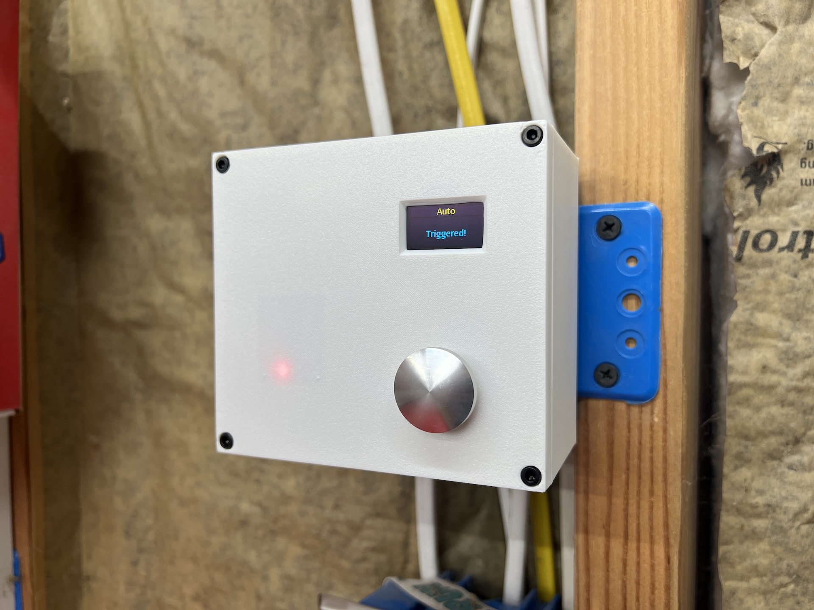

### The back-side of the cover plate with components mounted:
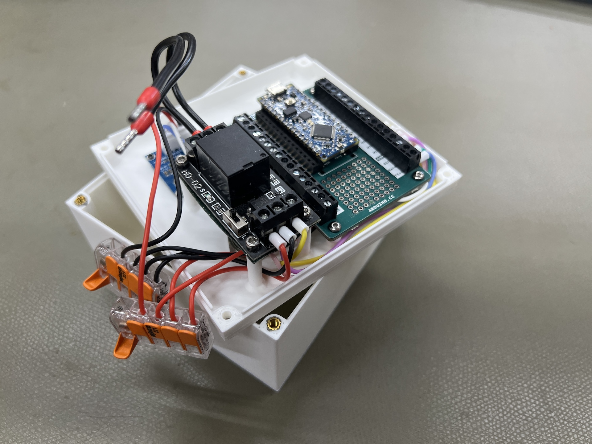

### Fully assembled:
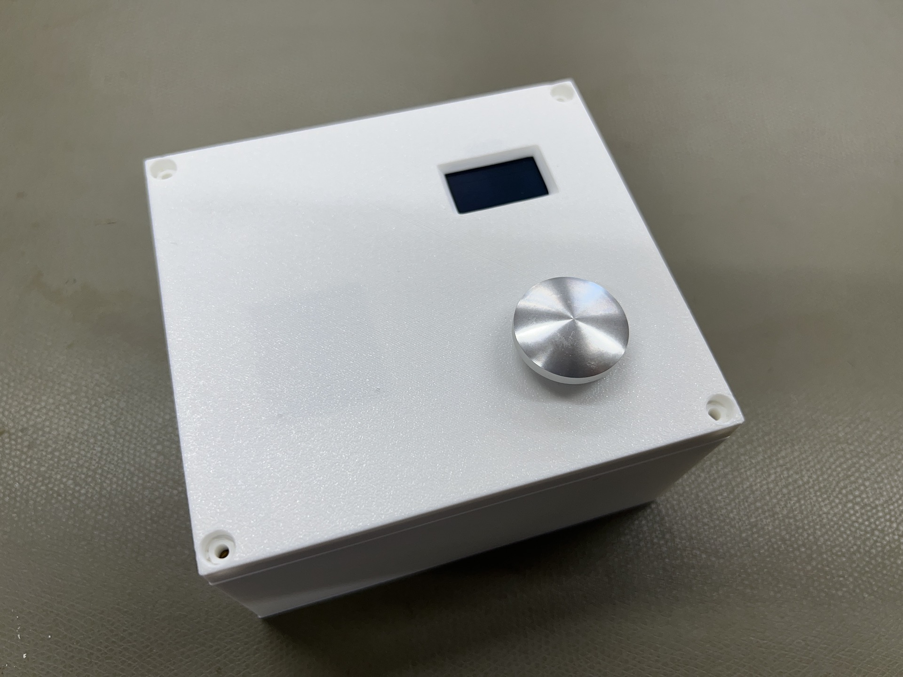

### Inside of the enclosure showing opening to the double-gang electrical box behind it:
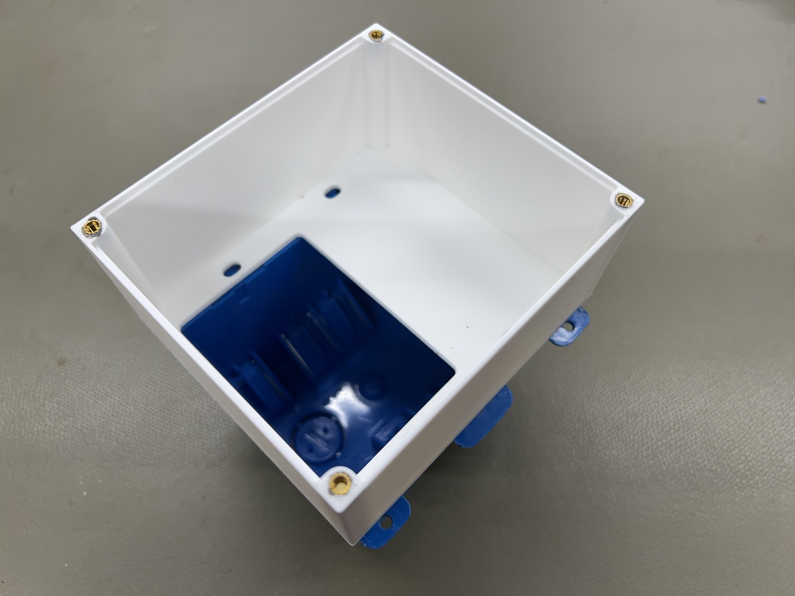

### Fully assembled and mounted to double-gang electrical box:
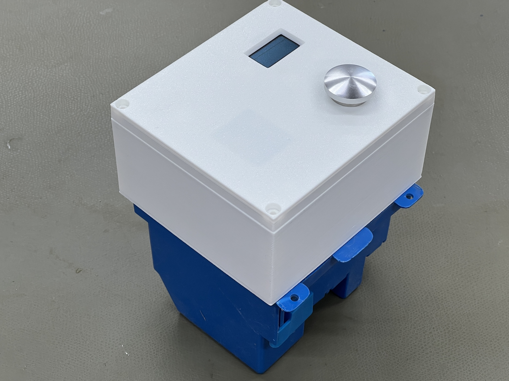

### Peek beneath the Arduino Nano Screw Terminal Adapter, revealing the DFRobot 24GHz Human Presence Detection Sensor:
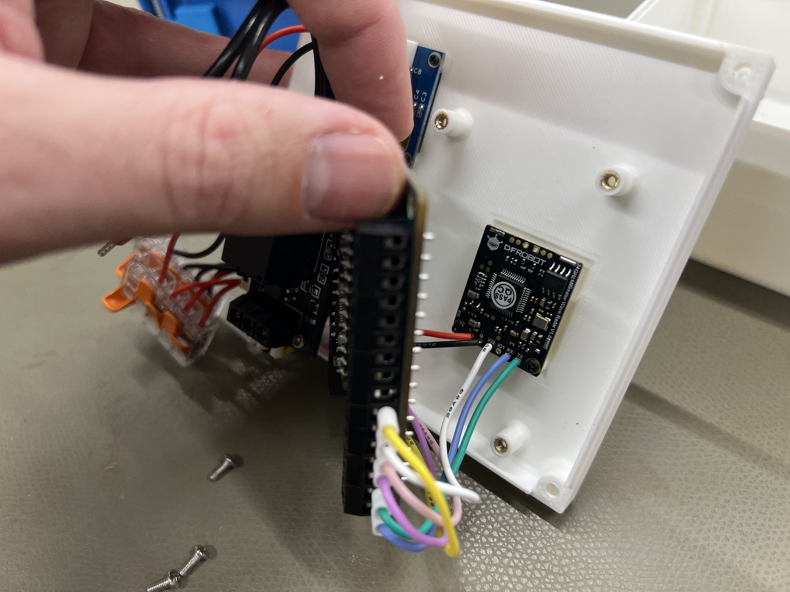

### Inside view revealing the 0.96" 128x64 OLED display secured with M1.7x4mm self-tapping screws:
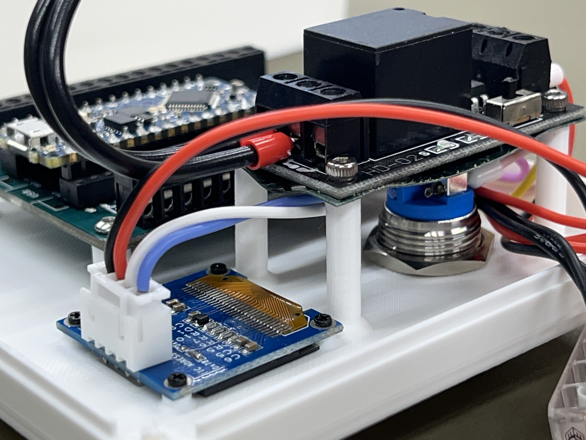

### Close-up of ferrule-terminated wiring in the Arduino Nano Screw Terminal Adapter with Arduino Nano Every microcontroller:
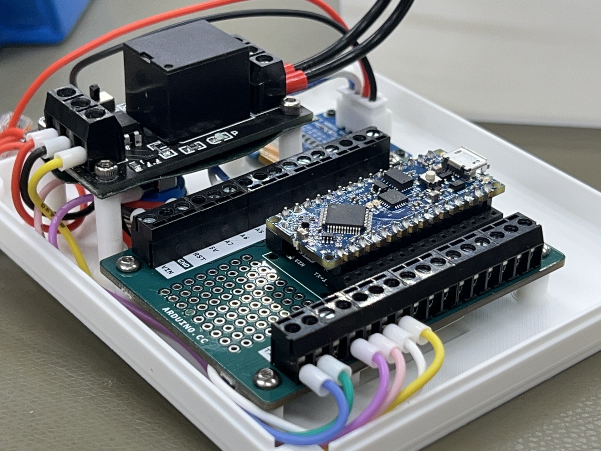

### Example of Radar Light Switch empty enclosure mounted to single-gang electrical box above existing light switch box:
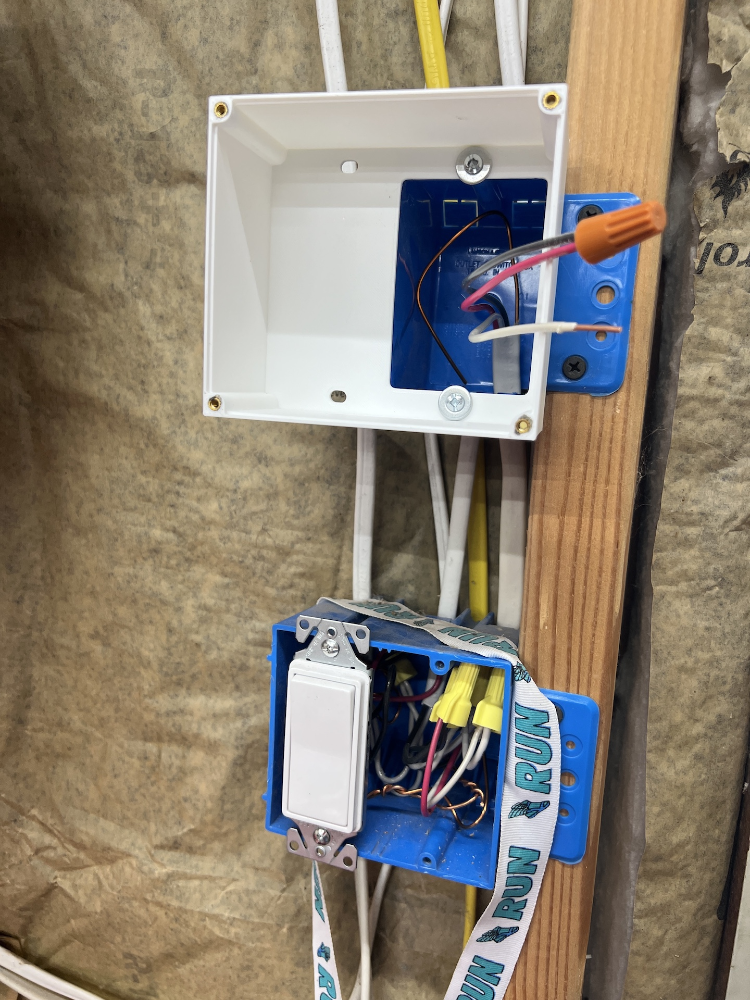

### Example of Radar Light Switch, fully assembled and mounted to single-gang electrical box above existing light switch box:
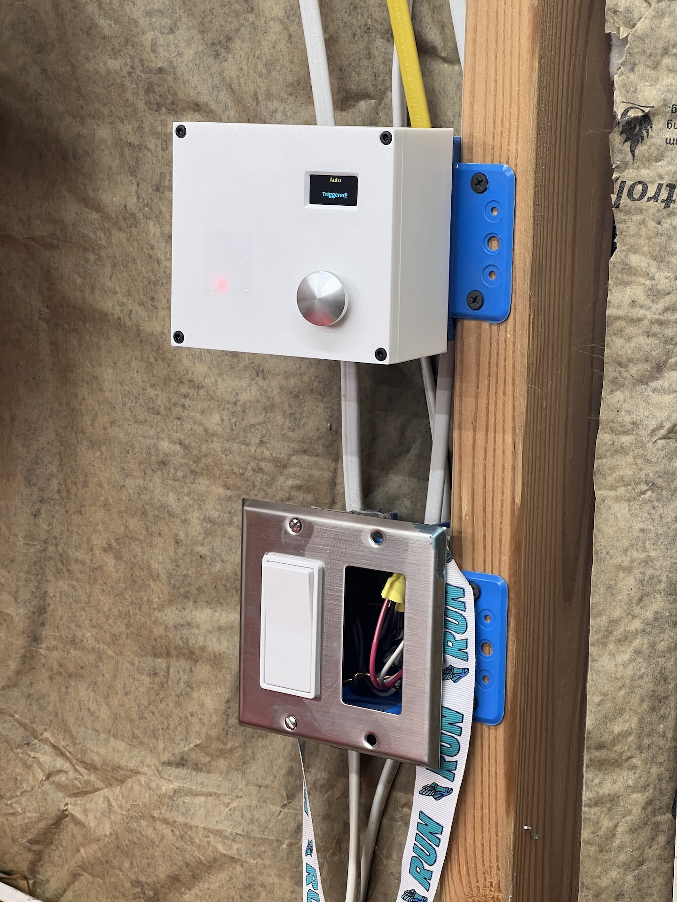

### Fully assembled and wired Radar Light Switch, with enclosure open, showing Wago connections:
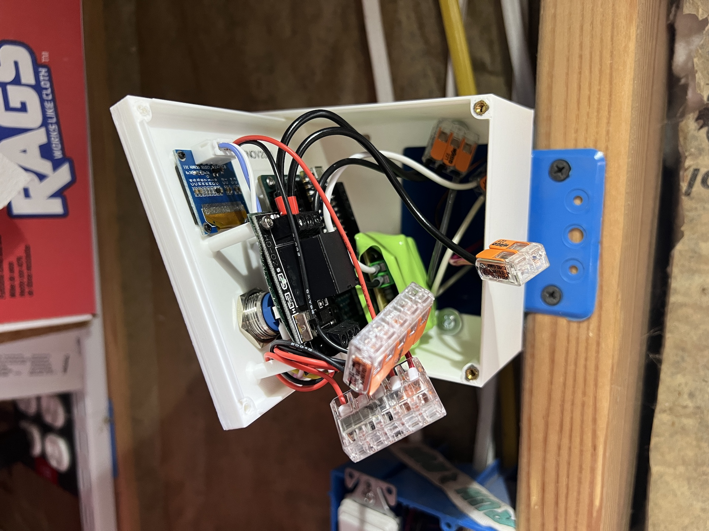
